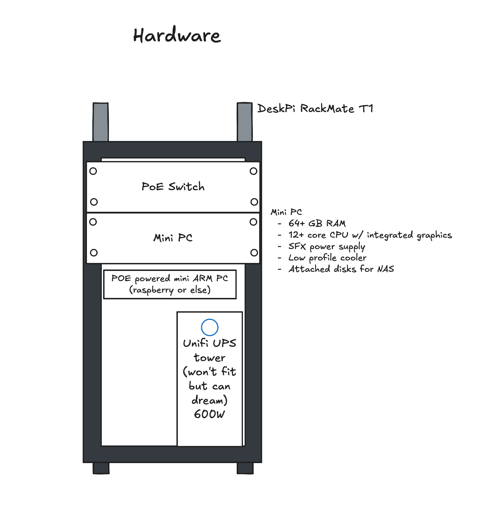
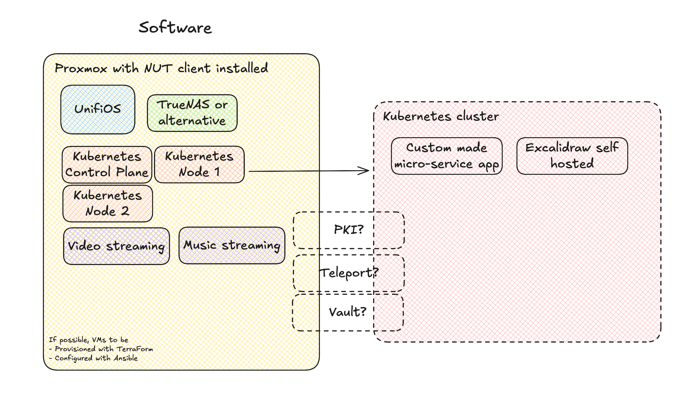
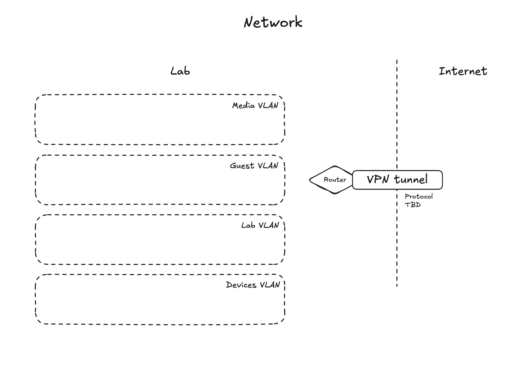

# The Homelab
## Purpose
Repository describing my homelab's targeted architecture.
The goal of this is to play around with hardware, networking, development and discovering various tools in general.

## Descriptions
### Hardware
One prerequisite will be to have a nice hardware setup. This includes a machine able to run Proxmox with a few VMs, a UPS for propoer shutdowns, and then can be upgraded with an ARM device for low power experiments.

### Software
Proxmox will be the founding block to try out different VMs, some categorized as "Prod" running all the time and some categorized as "Lab" for testing purposes. The goal is to be able to replace as many VMs as possible with containerized applications. Another goal is to develop my own micro-service application.

### Network
Network has not yet been decided. The end goal is to have secure segmentation between the various networks. Further improvement will be the remote access of one of those networks through a VPN.

## Tools used 
- Ghostty as a terminal
- Helix + Zed as code editors
- Excalidraw for diagrams
- ChatGPT for idea refinements
